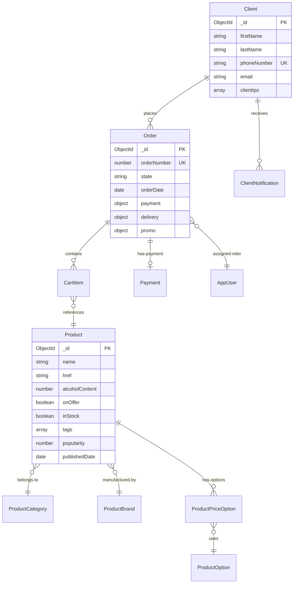

# Architecture Documentation

## System Overview

Dial A Drink Kenya is a full-stack e-commerce platform built using KeystoneJS 4.x, designed for online alcohol delivery services. The system follows a traditional MVC architecture with modern web development practices.

## High-Level Architecture

```
┌─────────────────┐    ┌──────────────────┐    ┌─────────────────┐
│   Client Apps   │    │   Web Frontend   │    │  Admin Panel    │
│  (Mobile/Web)   │    │   (Handlebars)   │    │  (KeystoneJS)   │
└─────────────────┘    └──────────────────┘    └─────────────────┘
         │                       │                       │
         │                       │                       │
         └─────────────────────┬─┴───────────────────────┘
                               │
                    ┌──────────▼──────────┐
                    │    Express.js       │
                    │   Application       │
                    │    (KeystoneJS)     │
                    └──────────┬──────────┘
                               │
                    ┌──────────▼──────────┐
                    │      Middleware     │
                    │  - Authentication   │
                    │  - Rate Limiting    │
                    │  - Caching          │
                    └──────────┬──────────┘
                               │
       ┌───────────────────────┼───────────────────────┐
       │                       │                       │
┌──────▼──────┐    ┌───────────▼──────────┐    ┌──────▼──────┐
│    Routes   │    │        Models        │    │   Workers   │
│  - Web      │    │     (Mongoose)       │    │ - Notific.  │
│  - API      │    │   - Products         │    │ - ETL       │
└─────────────┘    │   - Orders           │    │ - Cleanup   │
                   │   - Clients          │    └─────────────┘
                   └──────────────────────┘
                               │
                    ┌──────────▼──────────┐
                    │     MongoDB         │
                    │    Database         │
                    └─────────────────────┘
```

## Technology Stack Details

### Backend Framework
- **KeystoneJS 4.2.1**: Primary framework providing CMS functionality
- **Express.js**: Web server framework (embedded in Keystone)
- **Node.js 14+**: Runtime environment

### Database Layer
- **MongoDB**: Primary database via Mongoose ODM
- **Mongoose 5.13.5**: Object Document Mapping with schema validation
- **Deep Populate**: Plugin for complex relationship population

### Frontend Technologies
- **Handlebars**: Server-side templating engine
- **Express Static**: Static asset serving
- **LESS**: CSS preprocessing (development)
- **Grunt**: Build automation and asset compilation

### External Services Integration
```
┌─────────────────────────────────────────────────────────┐
│                External Services                        │
├─────────────────────────────────────────────────────────┤
│ Payment Gateways:                                       │
│  ├── PesaPal (Online payments)                         │
│  ├── M-Pesa (Mobile money)                             │
│  ├── CyberSource (Card payments)                       │
│  └── Africa's Talking (Mobile payments)                │
│                                                         │
│ Notifications:                                          │
│  ├── SMS: Africa's Talking, MoveSMS, MySMS            │
│  ├── Email: Nodemailer (SMTP)                         │
│  └── Push: FCM (Firebase Cloud Messaging)             │
│                                                         │
│ Infrastructure:                                         │
│  ├── Cloudinary (Image hosting/optimization)          │
│  ├── Google APIs (Maps, Geocoding)                    │
│  ├── Bitly (URL shortening)                           │
│  └── OKHi (Location verification)                     │
└─────────────────────────────────────────────────────────┘
```

## Application Structure

### Directory Layout
```
dial-a-drink-kenya/
├── app-init.js              # Application initialization
├── app.js                   # Web server entry point  
├── app-workers.js           # Background workers entry
├── package.json             # Dependencies and scripts
├── Gruntfile.js            # Build automation
│
├── models/                  # Data models (Mongoose schemas)
│   ├── Product.js          # Product catalog
│   ├── Order.js            # Order management
│   ├── Client.js           # Customer data
│   ├── AppUser.js          # Admin users
│   └── ...
│
├── routes/                  # Express routes
│   ├── index.js            # Route configuration
│   ├── middleware.js       # Global middleware
│   ├── views/              # Web page controllers
│   └── apis/               # REST API endpoints
│
├── helpers/                 # Utility classes and services
│   ├── mpesa.js            # M-Pesa integration
│   ├── PesaPal.js          # PesaPal integration
│   ├── sms/                # SMS service providers
│   └── mailer/             # Email services
│
├── workers/                 # Background processing
│   ├── index.js            # Worker orchestration
│   ├── DailyNotificationsProcessor.js
│   ├── ETLSalesFromOrders.js
│   └── ...
│
├── templates/               # Handlebars templates
│   ├── views/              # Page templates
│   └── email/              # Email templates
│
└── public/                  # Static assets
    ├── js/                 # Client-side JavaScript
    ├── styles/             # CSS files
    └── images/             # Static images
```

## Data Architecture

### Core Entity Relationships



### Data Flow Patterns

#### 1. Product Catalog Flow
```
Admin Panel → Product Model → Search Indexing → API Response → Frontend Display
     ↓
Cloudinary Image Processing → CDN Distribution
```

#### 2. Order Processing Flow
```
Cart Session → Order Creation → Payment Gateway → Payment Callback → 
Order Status Update → Notifications → Delivery Assignment → Completion
```

#### 3. Search and Recommendation Flow
```
User Query → Product.search() → Multiple Model Queries → 
Popularity Scoring → Related Products → Filtered Results
```

## Security Architecture

### Authentication & Authorization
```
┌─────────────────────────────────────────────────────┐
│                Authentication Flow                   │
├─────────────────────────────────────────────────────┤
│ Web Users:                                          │
│  ├── Session-based authentication                   │
│  ├── CSRF protection via keystone.security.csrf    │
│  └── Role-based access control                     │
│                                                     │
│ API Users:                                          │
│  ├── API key authentication                        │
│  ├── Session validation                            │
│  └── Request rate limiting                         │
│                                                     │
│ Admin Users:                                        │
│  ├── KeystoneJS admin authentication              │
│  ├── bcrypt password hashing                      │
│  └── Role permissions (admin model access)        │
└─────────────────────────────────────────────────────┘
```

### Data Protection
- **Password Hashing**: bcrypt with salt rounds
- **Input Validation**: Mongoose schema validation
- **XSS Protection**: Handlebars automatic escaping
- **SQL Injection**: MongoDB NoSQL nature + Mongoose ODM
- **CSRF Protection**: KeystoneJS built-in middleware

### API Security
```javascript
// Rate limiting by IP and user
const rateLimit = {
  general: '100 req/min/ip',
  search: '50 req/min/ip', 
  orders: '10 req/min/user'
};

// Input sanitization
const sanitize = [
  'express-validator',
  'mongoose-validation',
  'custom-filters'
];
```

## Caching Strategy

### Multi-Level Caching
```
┌─────────────────────────────────────────────────────┐
│                 Caching Layers                      │
├─────────────────────────────────────────────────────┤
│ Application Level:                                  │
│  ├── Memory Cache (product catalogs)               │
│  ├── LRU Cache (search results)                    │
│  └── Redis Cache (session data)                    │
│                                                     │
│ Database Level:                                     │
│  ├── Mongoose query caching                        │
│  ├── MongoDB connection pooling                    │
│  └── Index optimization                            │
│                                                     │
│ HTTP Level:                                         │
│  ├── Express static file caching                   │
│  ├── Cloudinary image CDN                          │
│  └── Browser caching headers                       │
└─────────────────────────────────────────────────────┘
```

### Cache Implementation
```javascript
// Memory cache with LRU eviction
const MemoryLRUCache = require('./helpers/MemoryLRUCache');
const cache = new MemoryLRUCache(1000); // 1000 item limit

// Redis integration for session storage
keystone.set('session store', 'mongo');

// Cloudinary image optimization and CDN
const cloudinary = {
  secure: true,
  fetch_format: "auto",
  transformation: [{
    width: 250,
    height: 250,
    crop: "fill"
  }]
};
```

## Background Processing Architecture

### Worker System Design
```
┌─────────────────────────────────────────────────────┐
│                Worker Architecture                   │
├─────────────────────────────────────────────────────┤
│ Worker Types:                                       │
│  ├── Notification Processors                       │
│  │   ├── SMS queue processing                      │
│  │   ├── Email queue processing                    │
│  │   └── Push notification delivery               │
│  │                                                 │
│  ├── ETL Workers                                   │
│  │   ├── Sales data extraction                    │
│  │   ├── Product catalog sync                     │
│  │   └── Analytics processing                     │
│  │                                                 │
│  └── Maintenance Workers                           │
│      ├── Database cleanup                         │
│      ├── Log rotation                             │
│      └── Cache invalidation                       │
└─────────────────────────────────────────────────────┘
```

### Worker Implementation
```javascript
// Worker orchestration in workers/index.js
class WorkerManager {
  start(delay = 2000) {
    setTimeout(() => {
      this.startNotificationProcessors();
      this.startETLWorkers();
      this.startMaintenanceWorkers();
    }, delay);
  }
}

// Individual worker example
class DailyNotificationsProcessor {
  constructor() {
    this.interval = 24 * 60 * 60 * 1000; // 24 hours
    this.isRunning = false;
  }
  
  process() {
    // Process pending notifications
    // Send daily summaries
    // Update metrics
  }
}
```

## Performance Optimization

### Database Optimization
```javascript
// Indexing strategy
const indexes = [
  { 'state': 1, 'publishedDate': -1 },           // Product queries
  { 'orderDate': -1, 'client': 1 },             // Order lookups
  { 'phoneNumber': 1, 'email': 1 },             // Client searches
  { 'tags': 1, 'category': 1, 'popularity': -1 } // Search optimization
];

// Connection pooling
mongoose.connect(mongoUri, {
  maxPoolSize: 10,
  bufferMaxEntries: 0,
  useNewUrlParser: true,
  useUnifiedTopology: true
});
```

### Application Performance
```javascript
// Lazy loading and pagination
const paginationDefaults = {
  page: 1,
  pageSize: 20,
  maxPageSize: 1500
};

// Asset optimization
const assetOptimization = {
  compression: 'gzip',
  minification: 'uglify + cssmin',
  bundling: 'grunt-contrib-concat',
  imageOptimization: 'cloudinary'
};
```

## Monitoring and Logging

### Application Monitoring
```javascript
// Error tracking and logging
const monitoring = {
  errorLogging: 'console + file',
  performanceMetrics: 'custom timing',
  healthChecks: '/health endpoint',
  uptime: 'pm2 monitoring'
};

// Key metrics tracked
const metrics = [
  'response_time',
  'error_rate', 
  'order_completion_rate',
  'payment_success_rate',
  'notification_delivery_rate'
];
```

### Operational Logging
```bash
# Log locations and rotation
/var/log/dialadrink/
├── application.log          # Main application logs
├── error.log               # Error logs
├── payment.log             # Payment transaction logs
├── notification.log        # SMS/Email logs
└── worker.log              # Background worker logs
```

## Scalability Considerations

### Horizontal Scaling
- **Load Balancing**: Nginx reverse proxy with multiple Node.js instances
- **Database Scaling**: MongoDB replica sets and sharding
- **Session Management**: Redis cluster for session storage
- **File Storage**: Cloudinary CDN for global image delivery

### Vertical Scaling
- **Memory Optimization**: LRU caching and memory monitoring
- **CPU Optimization**: Async processing and worker separation
- **I/O Optimization**: Database connection pooling and query optimization

### Microservices Migration Path
```
Monolithic KeystoneJS → Service Decomposition:
├── Product Catalog Service
├── Order Management Service  
├── Payment Processing Service
├── Notification Service
└── User Management Service
```

## Deployment Architecture

### Production Environment
```
┌─────────────────────────────────────────────────────┐
│                Production Setup                      │
├─────────────────────────────────────────────────────┤
│ Load Balancer (Nginx)                              │
│  ├── SSL Termination                               │
│  ├── Static file serving                           │
│  └── Request routing                               │
│                                                     │
│ Application Servers                                 │
│  ├── PM2 Process Manager                           │
│  ├── Node.js Cluster Mode                          │
│  └── Health monitoring                             │
│                                                     │
│ Database Cluster                                    │
│  ├── MongoDB Primary                               │
│  ├── MongoDB Secondaries                           │
│  └── Automated backups                             │
│                                                     │
│ External Services                                   │
│  ├── Cloudinary CDN                                │
│  ├── Payment gateways                              │
│  └── SMS/Email providers                           │
└─────────────────────────────────────────────────────┘
```

This architecture provides a robust, scalable foundation for the Dial A Drink Kenya e-commerce platform while maintaining flexibility for future enhancements and optimizations.